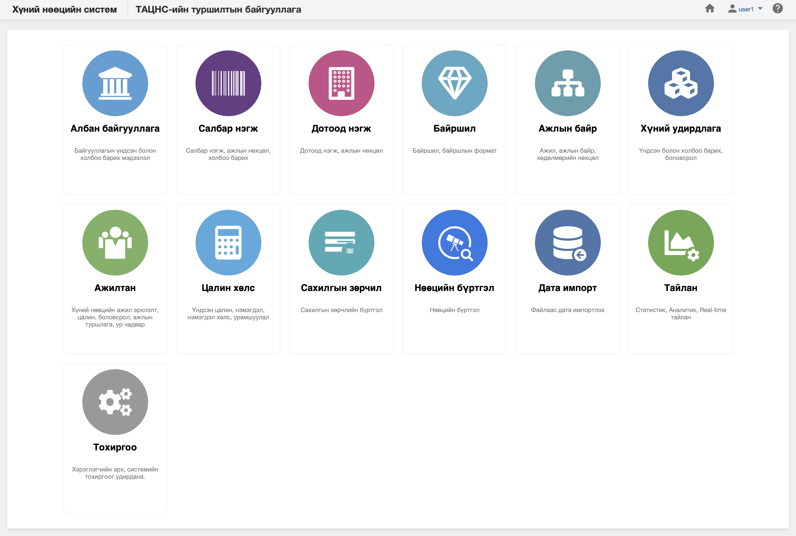

<h1 align="center">Хүний нөөцийн системийн онлайн гарын авлага</h1>

Хүний нөөцийн систем нь төрийн байгууллагууд, Төрийн албаны зөвлөл, түүний салбар зөвлөлийн хоорондын үйл ажиллагааны төвөгтэй хэсгийг дундын нэг удирдлагаар хангах систем юм. 

> Хэрэв та системийн интеграцийн талаар дэлгэрэнгүй мэдээлэл авах бол [ВЕБ СЕРВИСИЙН ГАРЫН АВЛАГА](https://hr.csc.gov.mn/doc/) хэсгээс авна уу.

## Хүний нөөцийн систем гэж юу вэ?

Хүний нөөцийн систем нь байгууллагын салбар, дотоод нэгж, ажилтан, ажил эрхлэлт, шилжилт хөдөлгөөн, байгууллага болон ажилтны профайл мэдээлэл, сургалт, сахилгын шийтгэл, нөөцийн бүртгэл гэх мэт байгууллагын өдөр тутмын үйл ажиллагааг зохион байгуулах мөн төрийн байгууллагууд,Төрийн албаны зөвлөл, түүний салбар зөвлөлийн хоорондын үйл ажиллагааг нэг удирдлагаар хангах систем юм.

•	Хүний нөөцийн системд төрийн байгууллага түүний бүтэц, байршил, орон тоо, ажлын байр, ажиллагсадын мэдээлэл, ажил эрхлэлт, давхар ажил, шилжилт хөдөлгөөн, цалин хөлс, нэмэгдэл урамшил, сахилгын зөрчил, нөөцийн бүртгэл зэрэг үйл ажиллагааг бүртгэж, удирдана. 

•	Хүний нөөцийн систем нь хэрэглэгчийн вэб систем болон вэб сервисээр дамжуулан мэдээллийн нэгдсэн сан үүснэ. Хүний нөөцийн системийн санд улсын хэмжээнд давхцалгүй, үнэн зөв, бодит цаг хугацааны мэдээлэл бий болсноор бүх түвшний хэрэглэгчид өөрийн эрх, үүргийн хүрээнд нэгдсэн мэдээллээр хангагдаж мэдээлэлд суурилсан шийдвэр гаргах, дүн шинжилгээ хийх, нэг төрлийн мэдээллийг олон төрлийн мэдээлэл хүсэгчид давтан гаргаж өгөх асуудал буурах боломж бүрдэнэ.

## Системийн шаардлага

ХНС-ийг ашиглахдаа хамгийн багадаа дараах шаардлагыг хангасан байна. Хэрэв та дараах шаардлагыг хангавал системийн боломж, давуу талыг ашиглах бүрэн боломжтой болно.

**Ерөнхий шаардлага:**

- Хэрэглэгчийн нэр, нууц үг
- Идэвхитэй интернет холболт

**Веб хөтөч:**

- [Apple Safari 5+](https://www.apple.com/safari/)
- [Apple Safari(iOS) 5+](https://www.apple.com/safari/)
- [Mozilla Firefox 10+](https://www.mozilla.org/en-US/firefox)
- [Google Chrome 15+](https://www.google.com/chrome/)
- [Google Chrome(Android) 18+](https://www.google.com/chrome/)
- [Microsoft Edge 20.10240.0.0+](https://www.microsoft.com/en-us/windows/microsoft-edge)
- [Microsoft Internet Explorer 9, 10, 11](https://www.microsoft.com/en-us/download/internet-explorer-11-for-windows-7-details.aspx)

> Хамгийн багадаа ашиглах веб хөтчийн хувилбарыг заав.

## Лиценз

2021 Төрийн албаны зөвлөл. Бүх эрх хуулиар хамгаалагдсан

## Өөрчлөлтийн түүх

Онлайн гарын авлагын сүүлийн өөрчлөлт хийсэн огноо **2021-01-11.**

|Өөрчлөлтийн огноо|Тайлбар|
|:----------------|:------|
|**2021-01-11**|Онлайн гарын авлагын шинэчилсэн програмд оруулсан.|