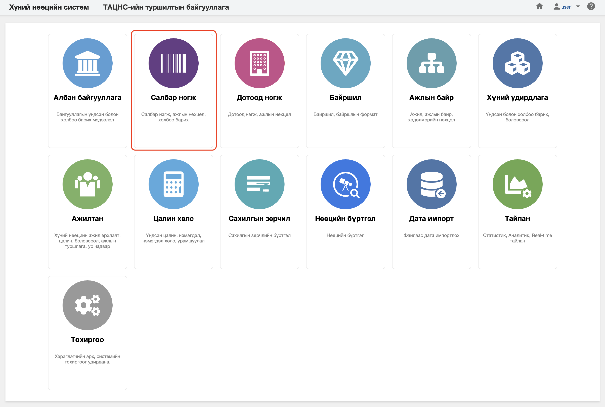

<h1 align="center">Салбар нэгж</h1>

Хуулийн дагуу үйл ажиллагаа явуулах хуулийн этгээдийг хүний нөөцийн системд  **салбар нэгж** гэж ойлгоно. 
 

Хүний нөөцийн системийн салбар нэгж модуль нь дараах хэсгээс бүрдэнэ.

Үүнд:

- [Хянах самбар](business_units/dashboard.md)
- [Жагсаалт, хайлт](business_units/list.md)
- [Тайлан](business_units/report.md)
- [Үйлдэл](business_units/action.md)