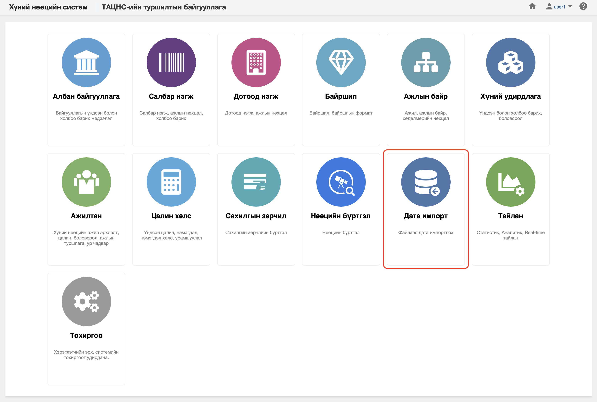

<h1 align="center">Дата импорт модуль</h1>

Дата импорт модуль нь их хэмжээний өгөгдлийг системд оруулахад хэрэглэгчийн үйл ажиллагааг хөнгөвчлөх, цаг хугацааг хэмнэх зорилготой юм.
 

Төрийн албаны хүний нөөцийн нэгдсэн системийн дата импорт модуль нь дараах хэсгээс бүрдэнэ.

Үүнд:

- [Ерөнхий](data_imports/overview.md)
- [Үйлдэл](data_imports/DataImportAction.md)
- [Импорт хийх процесс](data_imports/DataImportProcess.md)
- [Зөвлөмж](data_imports/DataImportAdvice.md)
