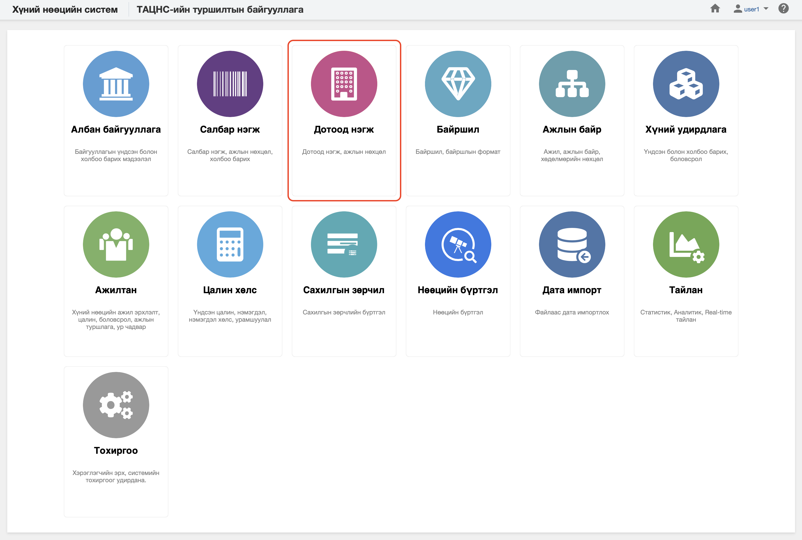

<h1 align="center">Дотоод нэгж</h1>

Хуулийн дагуу үйл ажиллагаа явуулах хуулийн этгээдийг хүний нөөцийн системд  **дотоод нэгж** гэж ойлгоно. 
 

Хүний нөөцийн системийн дотоод нэгж модуль нь дараах хэсгээс бүрдэнэ.

Үүнд:

- [Хянах самбар](departments/dashboard.md)
- [Жагсаалт, хайлт](departments/list.md)
- [Тайлан](departments/report.md)
- [Үйлдэл](departments/action.md)