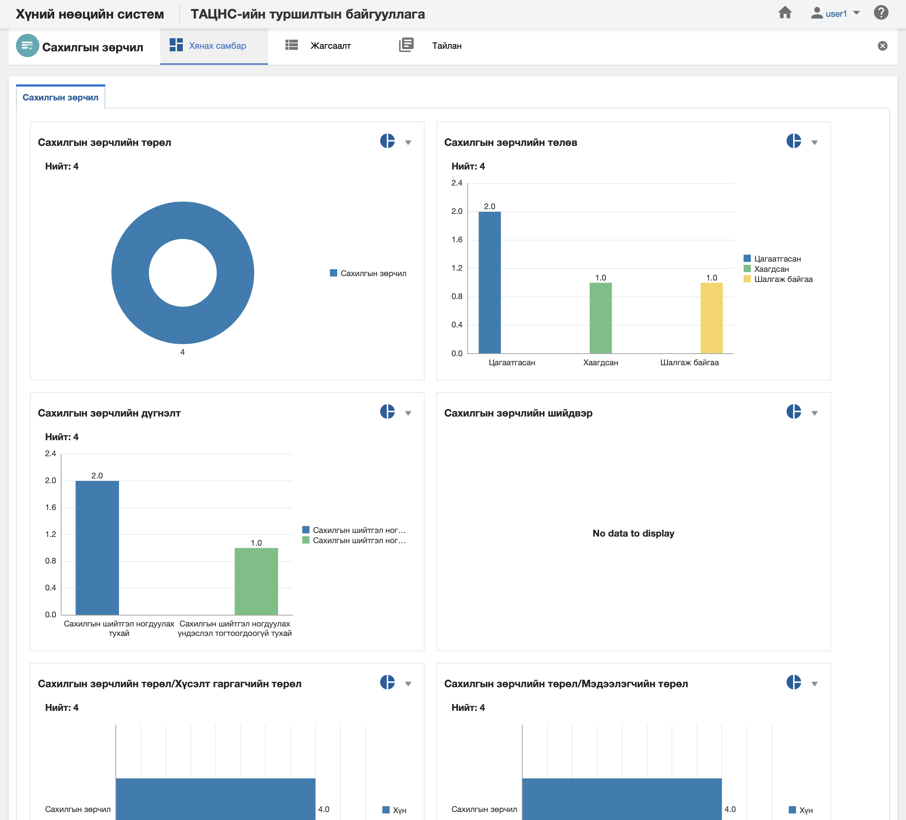

<h1 align="center">Сахилгын зөрчлийн хянах самбар</h1>

**Сахилгын зөрчлийн хянах самбар** нь тухайн байгууллагын сахилгын зөрчлийн бодит цаг хугацааны мэдээлэл дээр хяналт, шинжилгээ хийх боломжийг олгоно.

> Хянах самбартай ажиллах талаар ерөнхий ойлголтыг [хянах самбартай ажиллах](how-it-works?id=_4-Хянах-самбартай-ажиллах) хэсгээс харна уу.

 

**Сахилгын зөрчлийн хянах самбар нь дараах таб анализуудаас бүрдэнэ.** 

|Хянах самбарын таб|Тайлбар|
|:-----|:------|
|**Сахилгын зөрчил**|Сахилгын зөрчлийн мэдээллийн анализ|