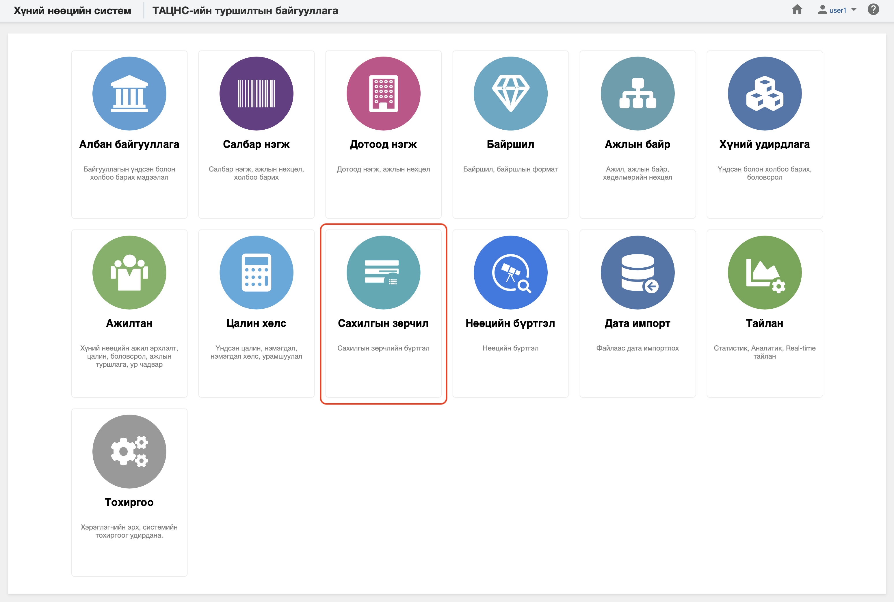

<h1 align="center">Сахилгын зөрчил</h1>

Хуулийн дагуу үйл ажиллагаа явуулах хуулийн этгээдийг хүний нөөцийн системд  **сахилгын зөрчил** гэж ойлгоно. 
 

Хүний нөөцийн системийн сахилгын зөрчил модуль нь дараах хэсгээс бүрдэнэ.

Үүнд:

- [Хянах самбар](disciplinaries/dashboard.md)
- [Жагсаалт, хайлт](disciplinaries/list.md)
- [Тайлан](disciplinaries/report.md)
- [Үйлдэл](disciplinaries/action.md)
