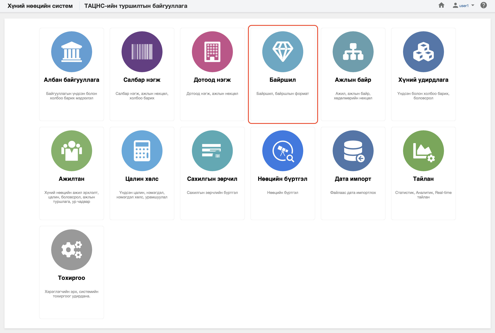

<h1 align="center">Байршил</h1>

Хуулийн дагуу үйл ажиллагаа явуулах хуулийн этгээдийг хүний нөөцийн системд  **байршил** гэж ойлгоно. 
 

Хүний нөөцийн системийн байршил модуль нь дараах хэсгээс бүрдэнэ.

Үүнд:

- [Хянах самбар](locations/dashboard.md)
- [Жагсаалт, хайлт](locations/list.md)
- [Тайлан](locations/report.md)
- [Үйлдэл](locations/action.md)
