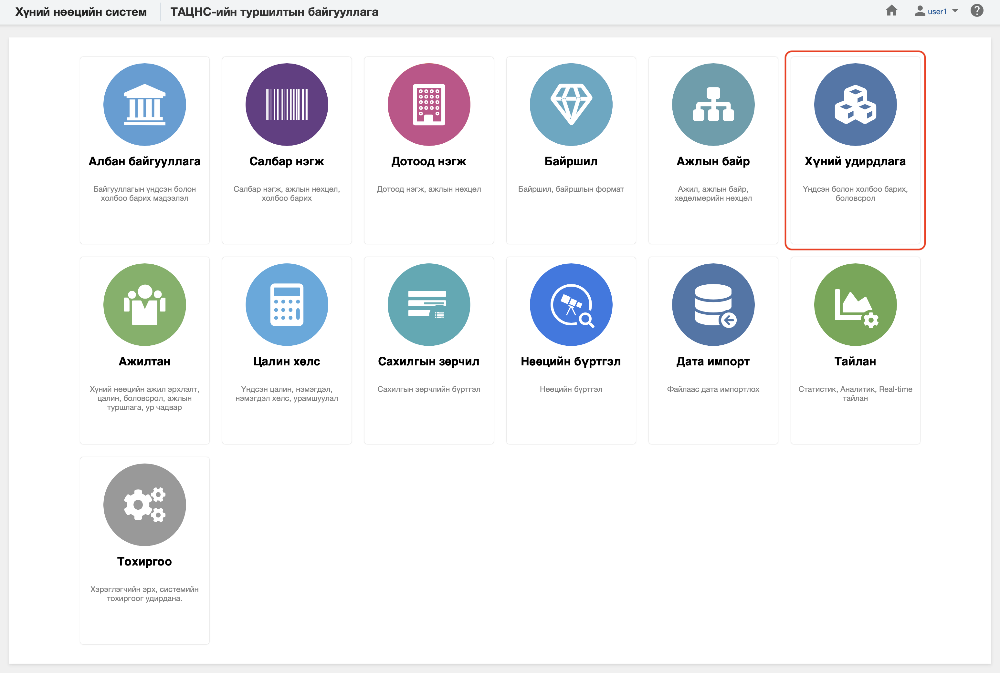

<h1 align="center">Хүний бүртгэл</h1>

Хуулийн дагуу үйл ажиллагаа явуулах хуулийн этгээдийг хүний нөөцийн системд  **хүний бүртгэл** гэж ойлгоно. 
 

Хүний нөөцийн системийн хүний бүртгэл модуль нь дараах хэсгээс бүрдэнэ.

Үүнд:

- [Хянах самбар](people/dashboard.md)
- [Жагсаалт, хайлт](people/list.md)
- [Тайлан](people/report.md)
- [Үйлдэл](people/action.md)