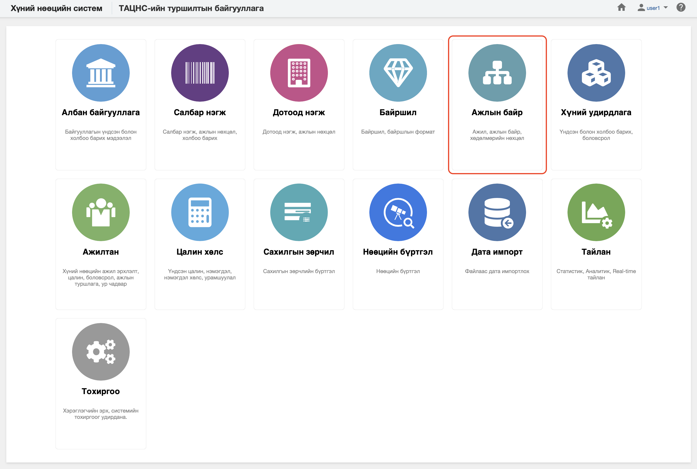

<h1 align="center">Ажлын байр</h1>

Хуулийн дагуу үйл ажиллагаа явуулах хуулийн этгээдийг хүний нөөцийн системд  **ажлын байр** гэж ойлгоно. 
 

Хүний нөөцийн системийн ажлын байр модуль нь дараах хэсгээс бүрдэнэ.

Үүнд:

- [Хянах самбар](positions/dashboard.md)
- [Жагсаалт, хайлт](positions/list.md)
- [Тайлан](positions/report.md)
- [Үйлдэл](positions/action.md)
