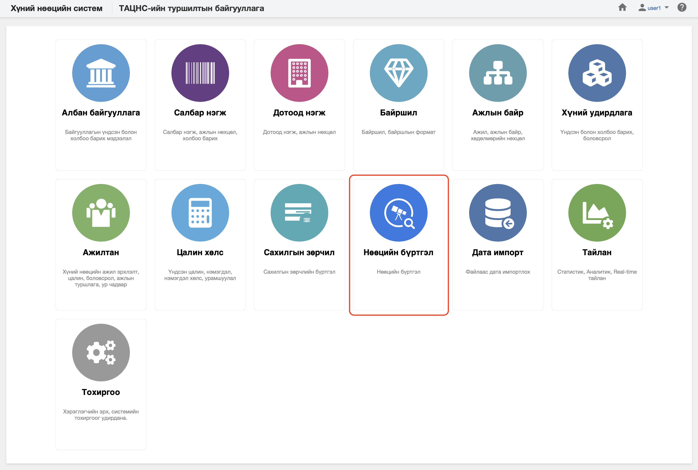

<h1 align="center">Нөөцийн бүртгэл</h1>

Хуулийн дагуу үйл ажиллагаа явуулах хуулийн этгээдийг хүний нөөцийн системд  **нөөцийн бүртгэл** гэж ойлгоно. 
 

Хүний нөөцийн системийн нөөцийн бүртгэл модуль нь дараах хэсгээс бүрдэнэ.

Үүнд:

- [Хянах самбар](resources/dashboard.md)
- [Жагсаалт, хайлт](resources/list.md)
- [Тайлан](resources/report.md)
- [Үйлдэл](resources/action.md)
