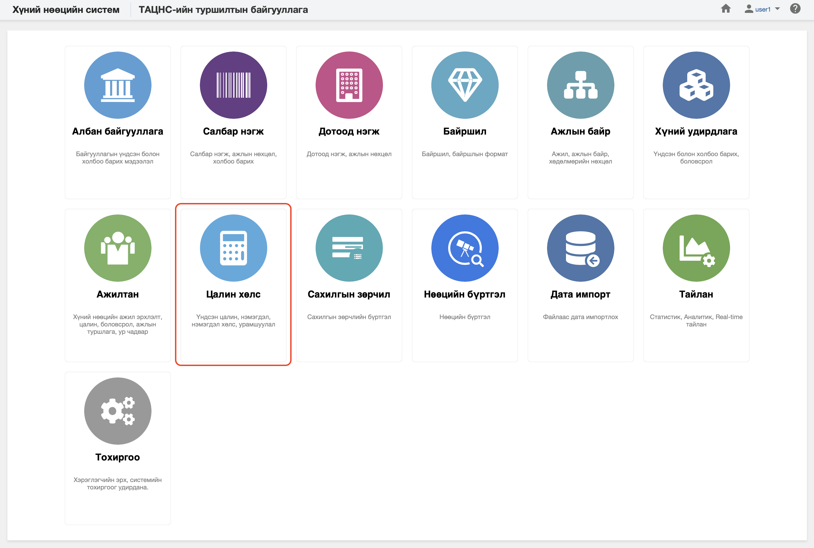

<h1 align="center">Цалин хөлс</h1>

Хуулийн дагуу үйл ажиллагаа явуулах хуулийн этгээдийг хүний нөөцийн системд  **цалин хөлс** гэж ойлгоно. 
 

Хүний нөөцийн системийн цалин хөлс модуль нь дараах хэсгээс бүрдэнэ.

Үүнд:

- [Хянах самбар](salaries/dashboard.md)
- [Үндсэн цалин](salaries/salary_list.md)
- [Нэмэгдэл цалин хөлс](salaries/compensation_list.md)
- [Тайлан](salaries/report.md)
- [Үйлдэл](salaries/action.md)