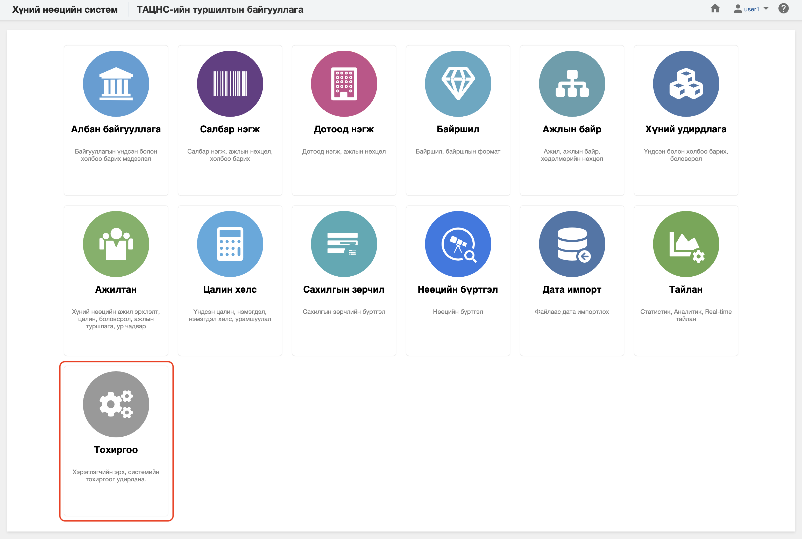

<h1 align="center"> Тохиргоо</h1>

Систем дээр хэрхэн ажиллах тохиргоог **ТОХИРГОО** цэс ашиглан хийнэ. 
 

Хүний нөөцийн системийн тохиргоо модуль нь дараах хэсгээс бүрдэнэ.

Үүнд:

- [Хэрэглэгчийн тохиргоо](settings/user_settings.md)
- [Системийн тохиргоо](settings/system_settings.md)
- [Платформын тохиргоо](settings/platform_settings.md)
