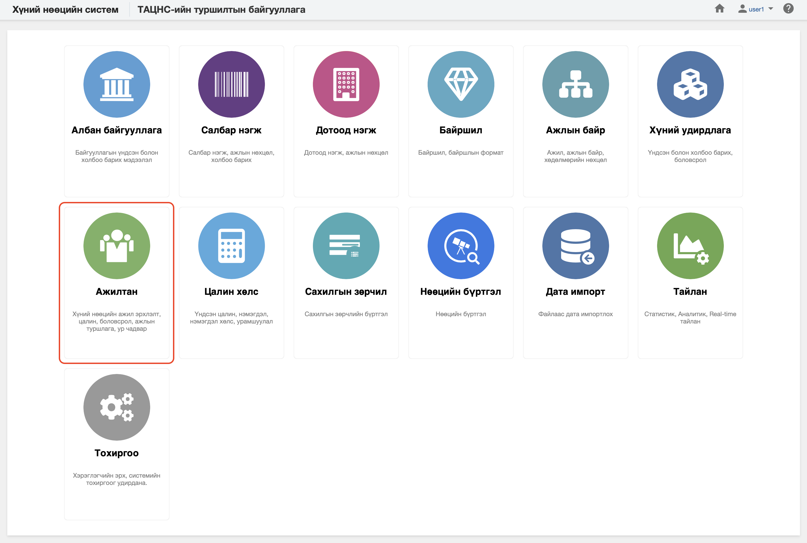

<h1 align="center">Ажилтан</h1>

Хуулийн дагуу үйл ажиллагаа явуулах хуулийн этгээдийг хүний нөөцийн системд  **ажилтан** гэж ойлгоно. 
 

Хүний нөөцийн системийн ажилтан модуль нь дараах хэсгээс бүрдэнэ.

Үүнд:

- [Хянах самбар](workers/dashboard.md)
- [Ажилтны жагсаалт](workers/worker_list.md)
- [Ажил эрхлэлтийн жагсаалт](workers/worker_employment_list.md)
- [Тайлан](workers/report.md)
- [Үйлдэл](workers/action.md)
